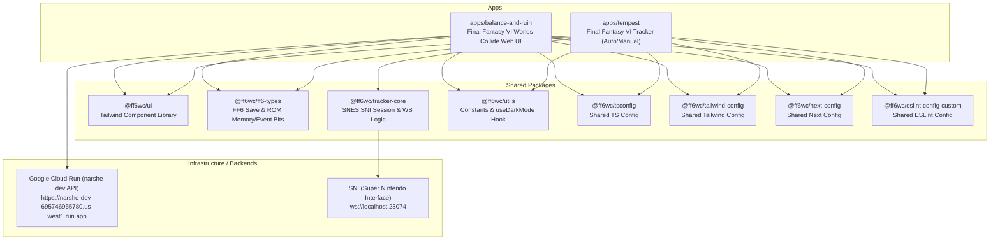

# 🤖 AI Agent Developer Guide — FF6WC Ultima Monorepo

Welcome, AI Agent! This guide is designed to orient you with the **FF6WC Ultima Monorepo** structure, development workflows, tools, and testing procedures. Review this document carefully before making changes or proposing plans.

---

## 🗺️ Monorepo Architecture & Dependencies

This repository is managed with **pnpm workspaces** and coordinated via **Turborepo**. Below is the visualization of how the components relate:



---

## 📁 Repository Directory Structure

When looking for files or trying to understand where to place your edits, follow this directory map:

```yaml
.
├── apps/
│   ├── balance-and-ruin/             # Next.js Pages UI for the randomizer flag creator
│   │   ├── card-components/          # Interactive cards representing groups of FF6WC flags
│   │   ├── page-components/          # Tabs for the Flag Creator (e.g. Graphics, Presets)
│   │   ├── components/               # App-specific UI components
│   │   ├── pages/                    # Main Next.js routing files (create.tsx, sotw/index.tsx)
│   │   ├── state/                    # Redux Toolkit slices (flagSlice, itemSlice, objectiveSlice)
│   │   └── styles/                   # Custom Next.js global and utility CSS styles
│   └── tempest/                      # Next.js Pages UI for the FF6 Worlds Collide Tracker
│       ├── components/               # EmoTracker and individual tracking grids
│       ├── pages/                    # Auto/manual tracker views, drag-and-drop overlays, OBS layouts
│       ├── queries/                  # RAM read queries for SnesSession (e.g. GetSaveDataQuery)
│       └── state/                    # Tempest state management
├── packages/
│   ├── eslint-config-custom/         # Central ESLint rules
│   ├── ff6-types/                    # Domain knowledge of FF6 memory offsets & game constants
│   ├── next-config/                  # Reusable Next.js settings
│   ├── tailwind-config/              # Universal Tailwind variables and layouts
│   ├── tracker-core/                 # WebSocket wrapper to query SNES emulator via SNI interface
│   ├── tsconfig/                     # Monorepo TypeScript rules
│   ├── ui/                           # Shares visual widgets (Buttons, Switches, CodeBlocks, etc.)
│   └── utils/                        # Basic helpers, dark-mode toggles, etc.
```

---

## 🛠️ CLI Operations & Commands

You MUST execute package management and turbo tasks using **pnpm** from the root workspace directory.

### Essential Commands

| Purpose                  | Command                                       | Notes                                                          |
| :----------------------- | :-------------------------------------------- | :------------------------------------------------------------- |
| **Install Dependencies** | `pnpm install`                                | Always run this if you edit `package.json` in any app/package. |
| **Development Mode**     | `pnpm dev`                                    | Starts all apps concurrently with hot reload.                  |
| **Single App Dev Mode**  | `pnpm --filter @ff6wc/balance-and-ruin dev`   | Spawns a localized dev server for the randomizer page.         |
| **Full Build**           | `pnpm build`                                  | Compiles and builds all packages and applications.             |
| **Single App Build**     | `pnpm --filter @ff6wc/balance-and-ruin build` | Compiles a specific application using Turborepo cache.         |
| **Lint Check**           | `pnpm lint`                                   | Validates linting constraints across the workspace.            |
| **Format Files**         | `pnpm format`                                 | Runs Prettier configurations on modified code.                 |

---

## 🔄 AI Step-by-Step Task Workflows

When implementing features or bug fixes, perform operations in this logical order:

### 1. Workflows for Shared Packages (`packages/*`)

If you modify `@ff6wc/ui`, `@ff6wc/tracker-core`, or `@ff6wc/ff6-types`:

1. Make your changes in the corresponding TS/TSX files in `packages/[name]`.
2. Run `pnpm build` (or `pnpm --filter @ff6wc/[name] build`) from the root. This is critical because Turborepo links dependencies by reference, and compiled assets must be generated in `dist` folders for Next.js apps to import them correctly.
3. Run `pnpm lint` to ensure no workspace-wide compilation errors.

### 2. Workflows for Creating/Editing Flags on the Randomizer (`balance-and-ruin`)

1. **Identify the Flag Metadata**: Review `apps/balance-and-ruin/flag_metadata.json` to inspect the available flag fields and types.
2. **Update Redux State**: If adding or editing the UI state schema for flags, update the relevant slice in `apps/balance-and-ruin/state/flagSlice.ts` or `schemaSlice.ts`.
3. **Modify the Card Component**: Locate the UI widget representing the flag group in `apps/balance-and-ruin/card-components/` (e.g. `GraphicsCard.tsx`, `KefkaCard.tsx`).
4. **Test Build Validity**: Execute `pnpm --filter @ff6wc/balance-and-ruin build` to verify there are no TypeScript interface mismatches.

### 3. Workflows for Adding Auto-Tracking Features (`tempest` & `tracker-core`)

1. **Register Memory Bits**: Define new event flags or character offsets in `packages/ff6-types/wc.ts` or `_eventBits.ts`. Remember to rebuild `@ff6wc/ff6-types`.
2. **Draft Snes RAM Query**: Add or update standard memory buffer query definitions in `apps/tempest/queries/`.
3. **Parse in UI State**: Connect the new memory-derived values in `apps/tempest/components/EmoTracker/EmoTracker.tsx` or `apps/tempest/utils/useTrackerData.tsx`.

---

## 🎨 UI & Design Guidelines for AI Agents

> [!IMPORTANT]
> **AESTHETICS ARE ABSOLUTELY CRITICAL.** High-fidelity visual presentation is non-negotiable. If you build interfaces that look generic or default, the development is considered to have **FAILED**.

- **Harmonious Palettes**: Avoid harsh defaults (like generic `#FF0000` reds or `#0000FF` blues). Use deep, rich HSL background layers, dark-mode friendly gray-blues (`#0f172a`), and vibrantly saturated neon accent accents (such as cyber-pinks, soft emeralds, or electric golds).
- **Typography**: Utilize premium typeface selections (Inter, Outfit, Roboto) through the `@next/font` configuration, instead of raw browser defaults.
- **Component Reuse**: Prioritize using shared layout widgets from `packages/ui` (such as `Button`, `Switch`, `CodeBlock`, `Input`, `Slider`, `Card`) rather than building ad-hoc elements with raw Tailwind in the application folders.
- **Micro-interactions**: Incorporate modern hover states, smooth transitions (`transition-all duration-300`), focus rings, and glassmorphism elements (`bg-white/10 backdrop-blur-md`).
- **Do Not Use Placeholders**: If an image or decorative badge is required, always generate a functional asset or draw it using Tailwind utility patterns.

---

## 🛟 Troubleshooting Common Errors

### 🔴 TypeScript Cannot Find Modules

**Symptom**: `Cannot find module '@ff6wc/ui' or its corresponding type declarations.`  
**Fix**: Run a full workspace build to compile the TS declarations.

```bash
pnpm build
```

### 🔴 Turborepo Caching Out of Sync

**Symptom**: Modified files are not taking effect during dev or build phases.  
**Fix**: Wipe the `.turbo` cache directory or force a build without cache:

```bash
pnpm build --force
```

### 🔴 WebSocket connection failure (Tempest auto-tracker)

**Symptom**: Overlay shows `Unexpectedly disconnected from SNI` or `Unable to connect to SNI`.  
**Fix**: Ensure a local instance of **SNI (Super Nintendo Interface)** or **QUsb2Snes** is active on port `23074` or `8080`, and a compatible emulator is running with a Final Fantasy VI Worlds Collide ROM loaded.
